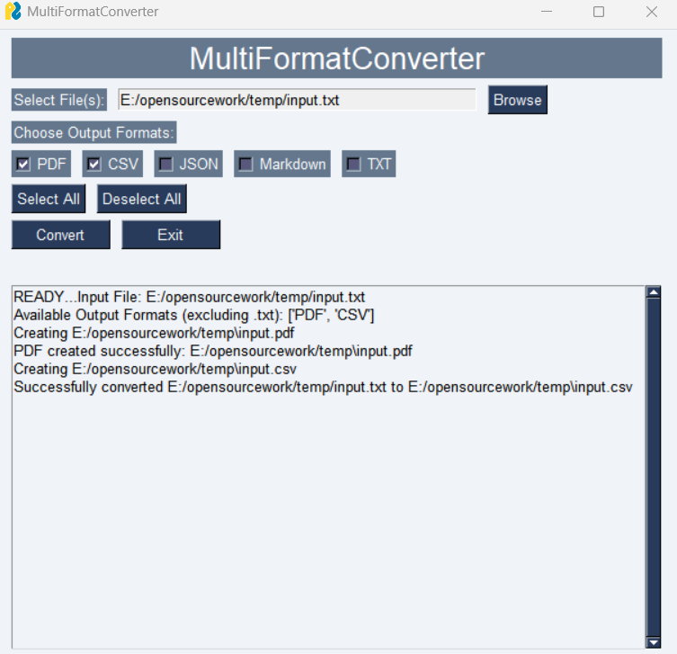

# 📦 multiformatconverter

A versatile Python GUI application to convert between various file formats including text, PDF, JSON, CSV, and Markdown (MD). The app supports seamless conversions between multiple formats with a user-friendly interface and robust error handling.

**multiformatconverter** is a lightweight and intuitive tool that empowers you to convert files effortlessly between text, PDF, JSON, CSV, and Markdown formats. It offers a visually appealing interface with clear conversion workflows and ensures proper validation to prevent unsupported conversions.

---

## 🔍 Key Features

- **Support for Multiple File Formats**  
  Seamlessly convert files between the following formats:
  
  - Text ↔ PDF  
  - Text ↔ JSON  
  - Text ↔ CSV  
  - Text ↔ Markdown  
  - PDF ↔ CSV  
  - JSON ↔ PDF  
  - And many more combinations!

- **User-Friendly GUI Interface**  
  Designed with **PySimpleGUI**, it provides a smooth and intuitive user experience.

- **Validation Mechanisms**  
  Prevents unsupported or erroneous conversions, ensuring all conversions follow proper format constraints.

- **Batch Conversion Support**  
  Convert to multiple file formats simultaneously with convenient selection checkboxes.

- **Open-Source Project**  
  Fully transparent and open for contributions under the MIT license.

---

## 📝 Table of Contents

1. [Usage](#-usage)  
2. [Robust Conversions](#-robust-conversions)  
3. [Contribution](#-contribution)  
4. [License](#-license)  
5. [Contact](#-contact)  
6. [Donations](#-donations)

---
## 📥 **Download Executable**

You can download the latest version of the **multiformatconverter** executable from the [Releases](https://github.com/manxlr/multiformatconverter/releases) page.
### Windows [Program](https://github.com/manxlr/multiformatconverter/releases/download/v1.0.0/multiformatconverter.exe)

---

## 🚀 **Usage**

- Go to the root directory in the command prompt and run **python main_gui.py** to bring up the conversion GUI. Now select **input file** and then select the **output formats (even more than one)** and click convert.
- The outputs of the same name will be created in the same directory as the input file.

## 🚀 **Usage**

- Go to root directory in command prompt and run **python main_gui.py** to bring up the conversion GUI. Now select **input file** and then select the **output formats (even more than one)** and click convert.
- The outputs of same name will be created in the same directory as the input file.

---

## 🛡️ **Robust Conversions**

- The program now converts to **valid formats** and ignores if only **original extension** is selected for conversion.

---

## 🤝 **Contribution**

We welcome contributions! If you have any improvements, bug fixes, or new test ideas, feel free to contribute to the repository:

- Fork the repository.
- Create a new branch.
- Submit a Pull Request with a detailed description of your changes.

### Repo Link: [https://github.com/manxlr/multiformatconverter](https://github.com/manxlr/multiformatconverter)

---

## 📜 **License**

This project is licensed under the **MIT License**, allowing you to freely use, modify, and distribute the code.

[MIT License](https://opensource.org/licenses/MIT)

---

## 📧 **Contact**

For any questions, suggestions, or feedback, please reach out:

- **Email**: [nszeeshankhalid@gmail.com](mailto:nszeeshankhalid@gmail.com)
- **GitHub**: [https://github.com/manxlr](https://github.com/manxlr)

---

## 💖 **Donations**

If you find this project helpful and would like to support its continued development, you can donate using the following cryptocurrency addresses:

- **Ethereum (ETH)**: `0x23774348bc491Ff70F39c63f39B0e542a59b5B14`  
- **Bitcoin (BTC)**: `bc1qp7wltg8frvecuujjs9f3ck28r0s0h0qzld2fu6`  
- **Dogecoin (DOGE)**: `DTbwxMs4wenN2kUea77rHPQ8nbJrSk4o7D` 
